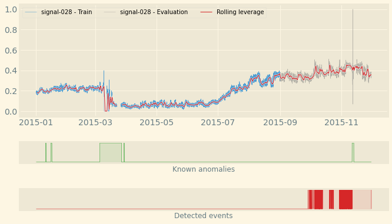
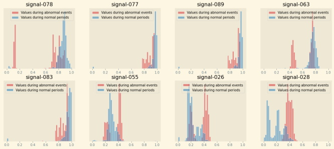
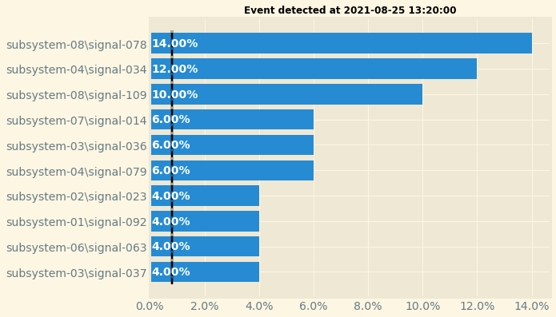

==========
User Guide
==========

Introduction
============

To build and use and anomaly detection model with Amazon Lookout for Equipment,
you need to go through the following steps:

#. Preparing your time series dataset and your historical maintenance time ranges
#. Upload your data on Amazon S3
#. Create a dataset and ingest the S3 data into it
#. Train a Lookout for Equipment model
#. Download and post-process the evaluation results
#. Configure and start a scheduler
#. Upload fresh data to Amazon S3
#. Download the inference results generated by the scheduler

The Amazon Lookout for Equipment SDK will help you streamline steps 3 to 8. Some
sample datasets are also provided along with some utility functions to tackle
steps 1 and 2.

Dataset management
==================

Creating a dataset
------------------

Let's start by loading a sample dataset and uploading it to a location on S3::

    from lookoutequipment import dataset
    
    root_dir = 'expander-data
    bucket = '<<YOUR-BUCKET>>'     # Replace by your bucket name
    prefix = '<<YOUR-PREFIX>>/'    # Don't forget the training slash
    role_arn = '<<YOUR-ROLE-ARN>>' # An ARN role with access to your S3 data

    data = dataset.load_dataset(
        dataset_name='expander', 
        target_dir=root_dir
    )
    dataset.upload_dataset(root_dir, bucket, prefix)
    
From there we are going to instantiate a class that will help us manage our
Lookout for Equipment dataset::
    
    
    lookout_dataset = dataset.LookoutEquipmentDataset(
        dataset_name='my_dataset',
        access_role_arn=role_arn,
        component_root_dir=f'{bucket}/{prefix}training-data'
    )
    
You will need to specify an ARN for a role that have access to your data on S3.
    
The following line creates the dataset in the Lookout for Equipment service. If
you log into your AWS Console and browse to the Lookout for Equipment datasets
list you will see an empty dataset::
    
    lookout_dataset.create()
    
Ingesting data into a dataset
-----------------------------
    
This dataset is empty: let's ingest our prepared data (note the trailing
slash at the end of the prefix)::

    response = lookout_dataset.ingest_data(bucket, prefix + 'training-data/')
    
The ingestion process will take a few minutes. If you would like to get a
feedback from the ingestion process, you can enable a waiter by replacing the
previous command by the following::

    response = lookout_dataset.ingest_data(
        bucket, 
        prefix + 'training-data/', 
        wait=True, 
        sleep_time=60
    )

Model training
==============

Once you have ingested some time series data in your dataset, you can train an
anomaly detection model::

    from lookoutequipment import model
    
    lookout_model = model.LookoutEquipmentModel(model_name='my_model', dataset_name='my_dataset')
    lookout_model.set_time_periods(data['evaluation_start'],
                                   data['evaluation_end'],
                                   data['training_start'],
                                   data['training_end'])
    lookout_model.set_label_data(bucket=bucket, 
                                 prefix=prefix + 'label-data/',
                                 access_role_arn=role_arn)
    lookout_model.set_target_sampling_rate(sampling_rate='PT5M')
    response = lookout_model.train()
    lookout_model.poll_model_training(sleep_time=300)
    
You will see a progress status update every five minutes until the training is
successful. With the sample dataset used in this user guide, the training can
take up to an hour.

Once your model is trained, you can either check the results over the evaluation
period or configure an inference scheduler.

Evaluating a trained model
==========================

Plot detected events
--------------------

Once a model is trained, the `DescribeModel API`_ from Amazon Lookout for 
Equipment will record the metrics associated to the training.

.. _DescribeModel API: https://docs.aws.amazon.com/lookout-for-equipment/latest/ug/API_DescribeModel.html

This API returns a dictionnary with two fields of interest to plot the 
evaluation results: ``labelled_ranges`` and ``predicted_ranges`` which 
respectively contain the known and predicted anomalies in the evaluation range.
Use the following SDK command to get both of these in a Pandas dataframe::

    from lookoutequipment import evaluation
    
    LookoutDiagnostics = evaluation.LookoutEquipmentAnalysis(model_name='my_model', tags_df=data['data'])
    predicted_ranges = LookoutDiagnostics.get_predictions()
    labeled_range = LookoutDiagnostics.get_labels()

**Note:** the labeled range from the DescribeModel API, only provides any 
labelled data falling *within the evaluation range*. If you want to plot or use
all of them (including the labels falling within the training range), you should
use the original label data by replacing the last line of the previous code
snippet by the following code::

    labels_fname = os.path.join(root_dir, 'labels.csv')
    labeled_range = LookoutDiagnostics.get_labels(labels_fname)
    
You can then plot one of the original time series signal and add an overlay of
the labeled and predicted anomalous events by levering the plot utilities::

    from lookoutequipment import plot
    
    TSViz = plot.TimeSeriesVisualization(timeseries_df=data['data'], data_format='tabular')
    TSViz.add_signal(['signal-001'])
    TSViz.add_labels(labeled_range)
    TSViz.add_predictions([predicted_ranges])
    TSViz.add_train_test_split(data['evaluation_start'])
    TSViz.add_rolling_average(60*24)
    TSViz.legend_format = {'loc': 'upper left', 'framealpha': 0.4, 'ncol': 3}
    fig, axis = TSViz.plot()
    
This code will generate the following plot where you can see:

* A **line plot** for the signal selected: the part used for training the model
  appears in blue while the evaluation part is in gray.
* The **rolling average** appears as a thin red line overlayed over the time series.
* The **labels** are shown in a green ribbon labelled "Known anomalies" (by default)
* The **predicted events** are shown in a red ribbon labelled "Detected events"
    

Plot signal distribution
------------------------
You might be curious about why Amazon Lookout for Equipment detected an 
anomalous event. Sometime, looking at a few of the time series is enough. 
But sometime, you need to dig deeper.

The following function, aggregate the signal importance of every signals over 
the evaluation period and sum these contributions over time for each signal. 
Then, it takes the top 8 signals and plot two distributions: one with the values 
each signal takes during the normal periods (present in the evaluation range) 
and a second one with the values taken during all the anomalous events detected 
in the evaluation range. This will help you visualize any significant shift of 
values for the top contributing signals.

You can also restrict these histograms over a specific range of time by setting 
the ``start`` and ``end`` arguments of the following function with datetime 
values::

    from lookoutequipment import plot
    
    TSViz = plot.TimeSeriesVisualization(timeseries_df=data['data'], data_format='tabular')
    TSViz.add_predictions([predicted_ranges])
    fig = TSViz.plot_histograms(freq='5min')

This code will generate the following plot where you can see a histogram for
the top 8 signals contributing to the detected events present in the evaluation
range of the model:

Scheduler management
====================

Once a model is successfully trained, you can configure a scheduler that will
run regular inferences based on this model::

    from lookout import scheduler

    lookout_scheduler = scheduler.LookoutEquipmentScheduler(
        scheduler_name='my_scheduler',
        model_name='my_model'
    )
    
    scheduler_params = {
        'input_bucket': bucket,
        'input_prefix': prefix + 'inference-data/input/',
        'output_bucket': bucket,
        'output_prefix': prefix + 'inference-data/output/',
        'role_arn': role_arn,
        'upload_frequency': 'PT5M',
        'delay_offset': None,
        'timezone_offset': '+00:00',
        'component_delimiter': '_',
        'timestamp_format': 'yyyyMMddHHmmss'
    }
    
    lookout_scheduler.set_parameters(**scheduler_params)
    
When the scheduler wakes up, it looks for the appropriate files in the input
location configured above. It also opens each file and only keep the data based
on their timestamp. Use the following command to prepare some inference data
using the sample we have been using throughout this user guide::

    dataset.prepare_inference_data(
        root_dir='expander-data',
        sample_data_dict=data,
        bucket=bucket,
        prefix=prefix
    )
    response = lookout_scheduler.create()

This will create a scheduler that will process one file every 5 minutes
(matchin the upload frequency set when configuring the scheduler). After 15
minutes or so, you shoud have some results available. To get these results 
from the scheduler in a Pandas dataframe, you just have to run the following 
command::

    results_df = lookout_scheduler.get_predictions()
    
In this dataframe, you will find one row per event (i.e. one row per scheduler
execution). You can then plot the feature importance of any given event. For
instance, the following code will plot the feature importance for the first
inference execution result::

    event_details = pd.DataFrame(results_df.iloc[0, 1:]).reset_index()
    fig, ax = plot.plot_event_barh(event_details)
    
This is the result you should have with the sample data:
    

    
Once you're done, do not forget to stop the scheduler to stop incurring cost::

    scheduler.stop()
    
You can restart your scheduler with a call to ``scheduler.start()`` and when
you don't have any more use for your scheduler you can delete a stopped scheduler
by running ``scheduler.delete()``.